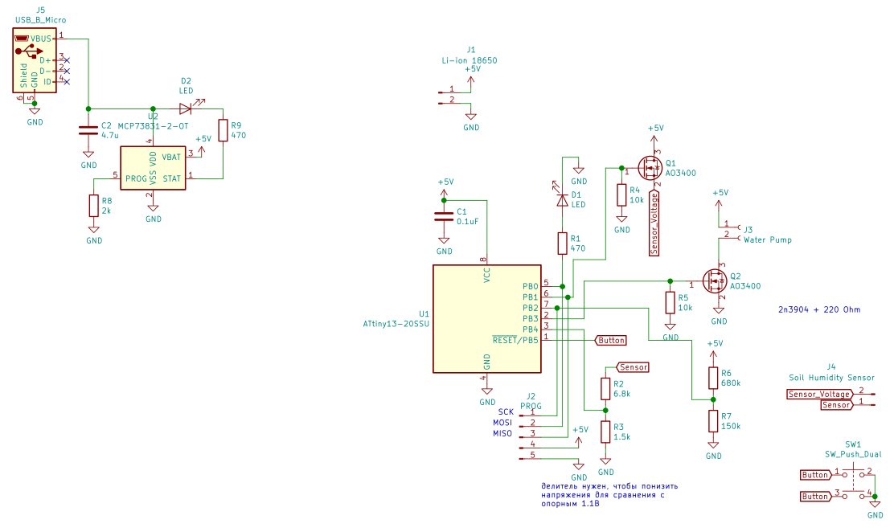

# Автополив на ATtiny13

Прошивка написана для микроконтроллера ATtiny13A. Печатная плата и схема для KiCAD находится в соответствующей папке. С кнопкой вышел косяк при разводке печатной платы, её развернуть надо и переразвести, надеюсь поправлю.

Питается от одной банки Li-ion 18650. В схеме предусмотрена микросхема  заряда аккума и контроль напряжения разряда (начнет мигать светодиод D1). В спящем режиме потребляет меньше 10 мкА и просыпается, чтобы проверить влажность почвы

## Маленькая инструкция

Клеммы датчика вставляются в земельку параллельно друг другу, насос со шлангом в воду и подключается аккумулятор. Порог сухости почвы настраивается константой `SOIL_LOW_LIMIT`, которая лежит в пределах от 0 до 255. Если напряжение на аккумуляторе опустится ниже ~3.4В, при каждой проверке светодиод будет моргать 2 раза. Пороговое напряжение задается константой `BATTERY_LOW_LIMIT`. В нормальном режиме один раз моргает светодиодом при проверке датчиков.

## По схеме

- Транзистор Q1 нужен, чтобы ток через датчик почвы протекал только в момент измерения (когда транизстор открыт)
- Q2 - включает/выключает насос
- R6/R7 - делитель для сравнения напряжения на батарее с внутренним опорным 1.1В
- R2/R3 - аналогично, но для датчика влажности почвы
- MCP73831 - микросхемка для контроля заряда аккумулятора

## По коду

Собирал компилятором avr-gcc, прошивал при помощи USBasp. Makefile присутствует. FUSE биты стандартные.

Выходит из сна (Power down) каждые 8с по прерыванию от WDG. Инкрементирует счетчик и если он больше значения  `UPDATE_TIME`, то измеряет напряжение на батарейке и на клеммах датчика. При этом моргает один раз светодиодом.

АЦП настроен в режим с левым смещением, младшие разряды опускаются, поэтому разрешение - 8 бит (от 0 до 255).

Для контроля времени включения насоса используется таймер, настроенный на счет миллисекунд. Время включения насоса регулируется константой `WATER_PUMP_TIME_MAX`.
